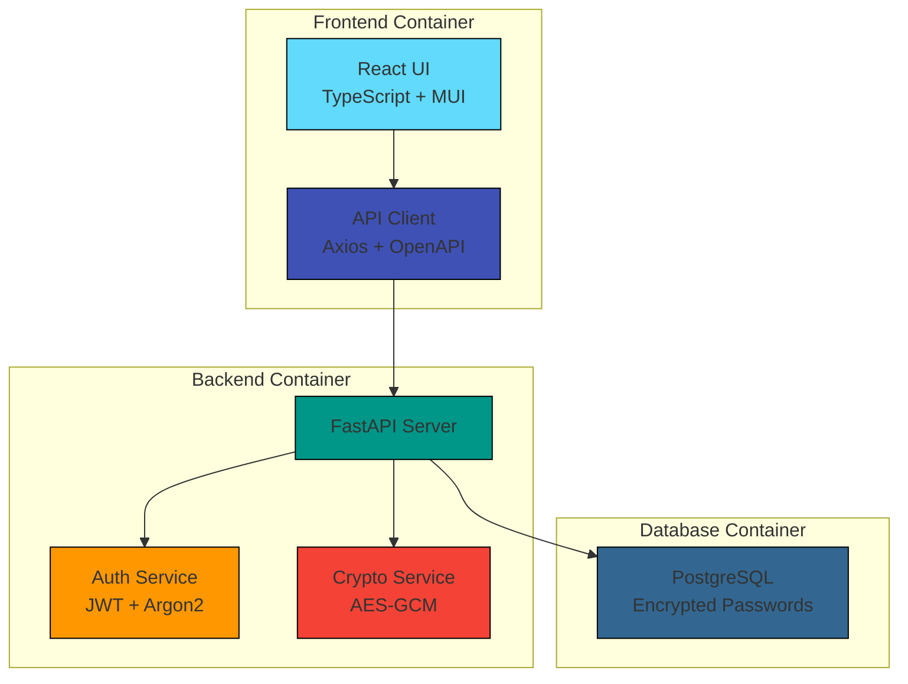

# PassMan NextGen

> A modern, secure password manager built with FastAPI, PostgreSQL, and React. Features AES-GCM encryption for credentials and Argon2-hashed master passwords.

[](https://github.com/medTrigui/passman-nextgen/actions/workflows/ci.yml)

## Overview

PassMan NextGen is a full-stack password manager that prioritizes security and user experience. Built with modern technologies and containerized for easy deployment, it provides a secure way to store and manage passwords.

### Key Features

- 🔐 **Secure Password Storage**
  - AES-256-GCM encryption with per-entry IV
  - Argon2id master password hashing
  - JWT-based authentication

- 🛠️ **Modern Tech Stack**
  - FastAPI backend with async support
  - React + TypeScript frontend
  - PostgreSQL database
  - Docker containerization

- 🔄 **Developer Experience**
  - OpenAPI documentation
  - Hot-reload development
  - Automated testing
  - Container-first deployment

## Architecture



## Project Structure

```
passman-nextgen/
│
├── backend/                   # FastAPI Application
│   ├── Dockerfile            # Multi-stage build
│   ├── pyproject.toml        # Poetry dependencies
│   ├── alembic/              # Database migrations
│   └── app/
│       ├── main.py           # Application factory
│       ├── core/             # Core functionality
│       │   ├── config.py     # Settings management
│       │   └── security.py   # Security utilities
│       ├── models/           # SQLAlchemy models
│       ├── schemas/          # Pydantic schemas
│       ├── services/         # Business logic
│       └── routers/          # API endpoints
│
├── frontend/                  # React Application
│   ├── Dockerfile            # Multi-stage build
│   ├── package.json          # npm dependencies
│   └── src/
│       ├── components/       # Reusable components
│       ├── pages/            # Route components
│       ├── services/         # API integration
│       ├── store/            # State management
│       └── types/            # TypeScript types
│
└── docker-compose.yml        # Container orchestration
```

## Getting Started

### Prerequisites

- Docker and Docker Compose
- Node.js 18+ (for local development)
- Python 3.11+ (for local development)
- PostgreSQL 15+ (for local development)

### Quick Start with Docker

1. Clone the repository:
   ```bash
   git clone https://github.com/medTrigui/passman-nextgen.git
   cd passman-nextgen
   ```

2. Copy and configure environment variables:
   ```bash
   cp .env.example .env
   # Edit .env with your settings
   ```

3. Start the application:
   ```bash
   docker compose up --build
   ```

4. Access the services:
   - Frontend: http://localhost:5173
   - API Docs: http://localhost:8000/docs
   - pgAdmin: http://localhost:5050

### Local Development

1. Start the backend:
   ```bash
   cd backend
   poetry install
   poetry run uvicorn app.main:app --reload
   ```

2. Start the frontend:
   ```bash
   cd frontend
   npm install
   npm run dev
   ```

## Security Features

### Password Storage
- Master passwords are hashed using Argon2id
- Site passwords are encrypted with AES-256-GCM
- Each password entry has a unique IV
- Zero plaintext password storage

### Authentication
- JWT-based authentication
- Secure token storage
- Rate limiting on auth endpoints
- Session management

### API Security
- CORS protection
- HTTPS enforcement
- Input validation
- SQL injection prevention
- XSS protection

## Roadmap

### v0.2 (In Progress)
- [ ] Password sharing functionality
- [ ] Rate limiting implementation
- [ ] Audit logging
- [ ] Password strength meter
- [ ] Export/Import functionality

### v0.3 (Planned)
- [ ] Two-factor authentication
- [ ] Password categories/tags
- [ ] Browser extension
- [ ] Mobile app
- [ ] Offline mode

## Contributing

We welcome contributions! Please see our [Contributing Guide](CONTRIBUTING.md) for details.

## License

This project is licensed under the MIT License - see the [LICENSE](LICENSE) file for details.

